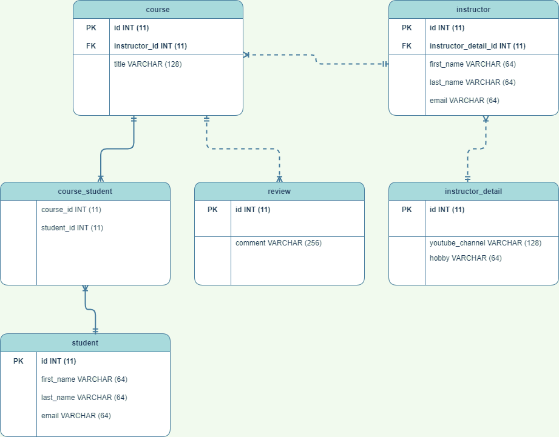
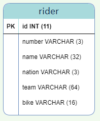

# Hibernate

<ol>
  <li>creating queries (CRUD package)</li>
    <ol>
      <li>Create</li>
      <li>Read</li>
      <li>Update</li>
      <li>Delete</li>
      <li>and more advanced using Query and HQL</li>
     </ol>
  <li>Relationship mapping (packages with the name: Mapping)</li>
     <ol>
       <li>One to one</li>
        <ol>
        <li>Uni-directional (@JoinColumn key word)</li>
	  Connection between instructor table and instructor_detail table mapped into objects in code. You can retrieve informations stored in instructor_detail table when you query instructor table. Data from instructor_detail table deleted when some data have been deleted from instructor table.
	<li>Bi-directional (mappedBy key wordk in @OneToOne)</li>
		Connection between instructor_detail object and instructor object. You can retrieve informations stored in instructor table when you query instructor_detail table or delete data from instructor table when have been deleted data instructor_detail table.	
       </ol>
	<li>One to many</li>
	     <ol>
		<li>Uni-directional (@JoinColumn key word)</li>
		<li>Bi-directional (mappedBy key word in @OneToMany)</li>
	     </ol>
	<li>Many to many</li>
	   Connection between tables via associative table, create, delete data from tables.
        </ol>
	<li>Delete, update data in tables (cascade key word)</li>
	<li>Eager i lazy loading (fetch key word)</li>
	    Retrieve data from table: all informations immediately or on request
</ol>

<h3>Database schema for relationship mapping</h3>

<h3>Database schema for CRUD</h3>

# Hibernate

<ol>
  <li>Tworzenie zapytań (paczka CRUD w projekcie)</li>
    <ol>
      <li>Create</li>
      <li>Read</li>
      <li>Update</li>
      <li>Delete</li>
      <li>oraz bardziej zaawansowanych wykorzystując zapytanie Query oraz HQL</li>
     </ol>
  <li>Mapowanie powiązań (paczki z nazwą Mapping w projekcie)</li>
     <ol>
       <li>Jeden do jeden</li>
        <ol>
        <li>Utworzenie powiązania jednokierunkowego na podstawie klucza obcego (słówko kluczowe @JoinColumn)</li>
          Zgodnie ze schematem bazy odwzorowanie połączenia tabeli instructor z tabelą instructor_detail w bazie na obiekty w kodzie, pozwalające 
		np. na otrzymywanie informacji zawartych w tabeli instructor_detail, gdy zapytanie dotyczy tabeli instructor lub na usuwanie wpisu z tabeli instructor_detail,
		gdy usunięto wpis z tabeli instructor
	<li>Utworzenie powiązania dwukierunkowego (słówko kluczowe mappedBy w @OneToOne)</li>
		Połączenie obiektu instructor_detail z obiektem instructor w kodzie, pozwalający np. na otrzymymwanie informacji zawartych w tabeli instructor, gdy zapytanie
		dotyczy tabeli instructor_detail lub na usuwanie wpisu z tabeli instructor gdy usunięto wpis z tabeli instructor_detail	
       </ol>
	<li>Jeden do wiele</li>
	     <ol>
		<li>Utworzenie powiązania jednokierunkowego (slowko kluczowe @JoinColumn)</li>
		<li>Utworzenie powiązania dwukierunkowego (slowko kluczowe mappedBy w @OneToMany)</li>
	     </ol>
	<li>Wiele do wiele</li>
	    Łączenie tabel za pomocą tabeli pomocniczej, tworzenie, usuwanie wpisów w tabelach
        </ol>
	<li>Usuwanie, aktualizowanie wpisów w powiązanych tabelach (słówko kluczowe cascade)</li>
	<li>Eager i lazy loading (słówko kluczowe fetch)</li>
	    Pobieranie informacji z tabel: od razu wszystkich informacji lub na żądanie 
</ol>

<h3>Schemat bazy dla mapowania</h3>

<h3>Schemat bazy dla CRUD</h3>

